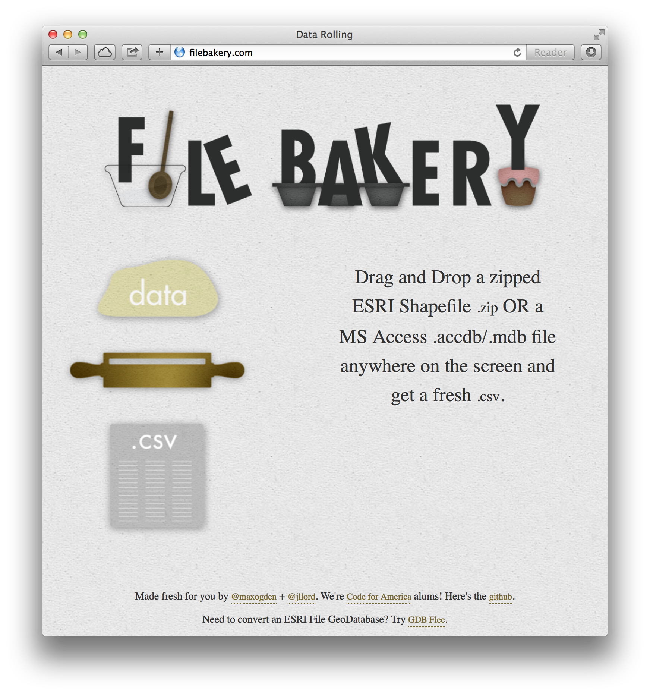

# Data Roller aka [FileBakery.com](http://www.filebakery.com)

A node webapp to convert data between different formats.

### To Use

Visit [http://www.filebakery.com](http://www.filebakery.com) and drag a file (zipped ESRI Shapefile or MS Access .accdb/.mdb) onto the screen. You'll get a .csv!

_A working work in progress that currently only supports turning these two file types into csv._

### To Run Locally

to compile the front end deps during development cd into the `attachments` folder and run `make` (assumes you have done `npm install browserify -g` and `npm install`)

**If you're interested in data transforming and such, check out my [dat project](http://www.github.com/maxogden/dat).**